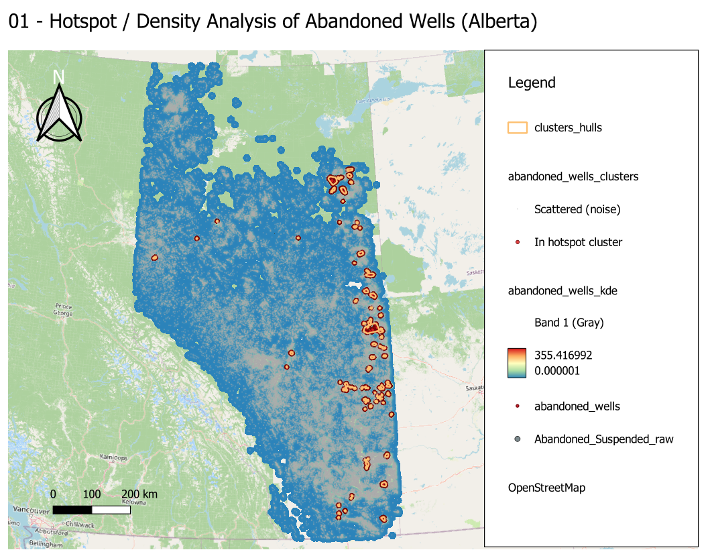

# Analysis 01 — Hotspot / Density Analysis of Abandoned Wells in Alberta

*Generated: 2026-04-29*

## 1. Objective
Identify the geographic concentrations of **abandoned** oil & gas wells across
Alberta to support orphan-well liability assessment, methane-leakage risk
screening, and prioritisation of decommissioning resources. Two complementary
techniques are used:

1. **Kernel Density Estimation (KDE)** — a continuous density surface showing
   *where* wells are most concentrated.
2. **DBSCAN clustering** — discrete cluster polygons identifying *which* groups
   of wells form coherent hotspots above a stated density threshold.

## 2. Input Data
| Item | Value |
|------|-------|
| Source dataset | `Abandoned_Suspended_raw.shp` (Alberta Energy Regulator origin) |
| Source CRS | EPSG:4269 (NAD83 geographic, degrees) |
| Source feature count | 94,428 wells |
| Filter applied | `Status = 'Abandoned'` |
| Filtered feature count | **94,110** abandoned wells (the other 318 were 'Suspension') |
| Working CRS | **EPSG:3400** (NAD83 / Alberta 10-TM Forest, units = metres) |
| Persisted as | `Input/abandoned_wells.gpkg` |

The reprojection from geographic to Alberta 10-TM is **essential** — KDE
bandwidths and DBSCAN distances must be specified in metres for any
distance-based analysis to be meaningful.

## 3. Methodology

### 3.1 Data Preparation
1. Loaded `Abandoned_Suspended_raw.shp` into QGIS.
2. Filtered features with `native:extractbyattribute` where `Status = 'Abandoned'`.
3. Reprojected the subset to EPSG:3400 with `native:reprojectlayer`.
4. Persisted the cleaned, reprojected layer to `Input/abandoned_wells.gpkg`.

### 3.2 Kernel Density Estimation
Algorithm: `qgis:heatmapkerneldensityestimation`

| Parameter | Value | Rationale |
|---|---|---|
| Kernel shape | Quartic | Smooth, well-behaved decay; QGIS default |
| Radius (bandwidth) | **10,000 m** | 10 km — preserves regional patterns while smoothing local noise |
| Pixel size | **1,000 m** | 1 km — balances detail and computation across Alberta's ~660,000 km² |
| Output value | Raw | Intensity is comparable across the whole map |

Output: `Output/abandoned_wells_kde.tif` (single-band float32 raster).

### 3.3 DBSCAN Spatial Clustering
Algorithm: `native:dbscanclustering`

| Parameter | Value | Rationale |
|---|---|---|
| Min cluster size | **50** | A meaningful hotspot must contain ≥50 abandoned wells |
| Eps (max distance) | **2,000 m** | Wells within 2 km belong to the same cluster |

Each input well is tagged with `CLUSTER_ID` (NULL = noise / scattered) and
`CLUSTER_SIZE`. Output: `Output/abandoned_wells_clusters.gpkg`.

### 3.4 Cluster Footprints
A convex hull was computed per `CLUSTER_ID` using `qgis:minimumboundinggeometry`,
restricted to non-noise points. Output: `Output/cluster_hulls.gpkg`.

## 4. Outputs
| File | Type | Contents |
|------|------|----------|
| `Input/abandoned_wells.gpkg` | Vector (Point) | 94,110 abandoned wells, EPSG:3400 |
| `Output/abandoned_wells_kde.tif` | Raster (GeoTIFF) | KDE intensity surface, 1 km cells |
| `Output/abandoned_wells_clusters.gpkg` | Vector (Point) | Wells with `CLUSTER_ID` and `CLUSTER_SIZE` |
| `Output/cluster_hulls.gpkg` | Vector (Polygon) | Convex hull per cluster (88 polygons) |
| `01_Hotspot_Density_Analysis.qgz` | QGIS project | Pre-styled, ready to open |

> **Note on raster format:** the KDE result is stored as a GeoTIFF rather than
> a GeoPackage raster because GeoTIFF is the de-facto standard for analytic
> rasters and has substantially better tooling support. All vector outputs
> remain in GeoPackage as requested.

## 5. Key Findings

### 5.1 Cluster summary
- **88** statistically meaningful hotspots identified.
- **18,910 wells (20.1 %)** belong to a hotspot cluster.
- **75,200 wells (79.9 %)** are scattered (noise) — solo or in groups too sparse to qualify.
- Largest cluster contains **1,902 wells**; median cluster size is 122.

### 5.2 Top 10 hotspots
| Rank | Cluster ID | Wells | Centroid (Lat, Lon) | Likely region |
|-----:|-----------:|------:|:--------------------|:--------------|
| 1 | 6 | 1,902 | 53.803 N, 110.588 W | Lloydminster heavy oil belt |
| 2 | 52 | 1,718 | 57.309 N, 111.827 W | Athabasca Oil Sands (Fort McMurray area) |
| 3 | 38 | 786 | 57.063 N, 111.420 W | Athabasca Oil Sands (Fort McMurray area) |
| 4 | 9 | 783 | 54.589 N, 110.430 W | Cold Lake heavy oil |
| 5 | 4 | 684 | 54.697 N, 110.708 W | Cold Lake heavy oil |
| 6 | 12 | 602 | 52.474 N, 110.059 W | Wainwright / Lloydminster south |
| 7 | 49 | 568 | 55.068 N, 110.504 W | Cold Lake heavy oil |
| 8 | 29 | 530 | 52.550 N, 111.671 W | East-central Alberta (Stettler / Provost) |
| 9 | 74 | 526 | 57.533 N, 111.056 W | Athabasca Oil Sands (Fort McMurray area) |
| 10 | 18 | 416 | 50.189 N, 110.479 W | Medicine Hat gas field |

### 5.3 Interpretation
The hotspots align almost perfectly with Alberta's known petroleum geography:
- The **largest two clusters** lie along the AB/SK border (Cold Lake / Lloydminster
  heavy-oil corridor) and in the **Athabasca oil sands** around Fort McMurray —
  exactly the zones with the most intensive historical drilling.
- A cluster around 50.2 N, 110.5 W matches the **Medicine Hat shallow gas field**,
  one of the world's largest collections of low-pressure gas wells.
- The dominance of *scattered* (noise) wells (~80 %) reflects Alberta's vast
  conventional-oil and shallow-gas footprint outside the major plays.

## 6. How to Reproduce
1. Open `01_Hotspot_Density_Analysis.qgz` in QGIS 3.x.
2. All four layers should load with their pre-set styling. If paths break
   (project moved), repoint each source to the matching file under `Input/`
   or `Output/`.
3. To re-run with different parameters, re-execute the steps in §3 via the
   Processing Toolbox or a PyQGIS script.

## 7. Notes & Caveats
- KDE bandwidth (10 km) and DBSCAN EPS (2 km) are exploratory choices.
  Tightening EPS to 1 km or below would split mega-clusters; loosening it
  would chain them into super-clusters.
- 'Abandoned' status only — the 318 'Suspension' wells (potentially
  reactivatable) are excluded and analysed separately in Analysis 03.
- A handful of source points lie marginally outside Alberta's official
  boundary (the raw extent is 119.99 W to 110.0 W, 49 N to 60 N).
- Convex hulls overstate hotspot footprints when clusters are non-convex.
  Concave hulls (alpha shapes) could be substituted if a tighter polygon is
  required.

---

## Map Preview

